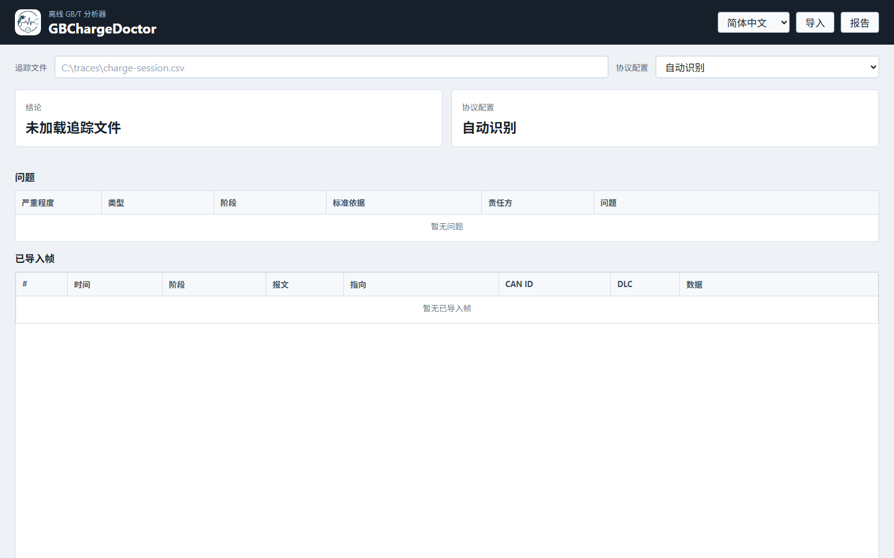
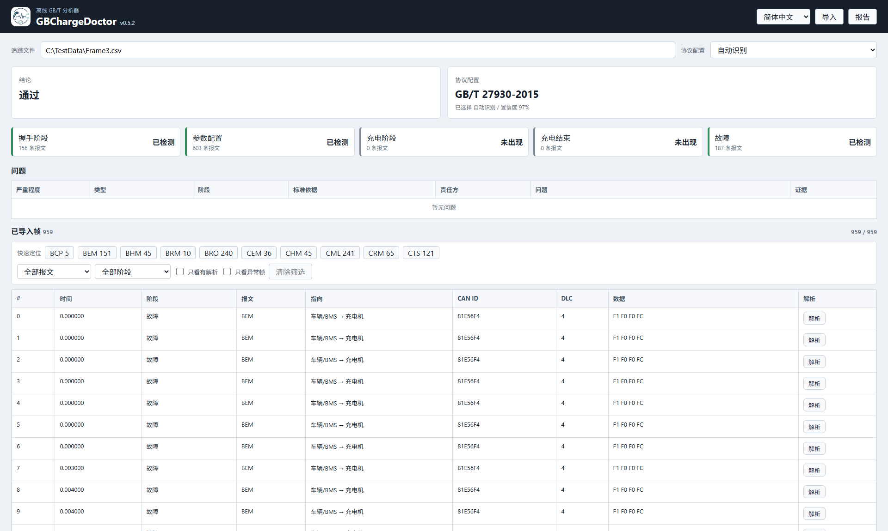

# GBChargeDoctor

### GB/T 27930 充电报文分析与故障定位工具

把 CSV / ASC / TXT / BLF / PCAP 充电通信数据变成可读、可定位、可交付的诊断结论。

[最新版本](https://github.com/RupingLiu/GBChargeDoctor-Releases/releases/latest) · [自动更新清单](https://github.com/RupingLiu/GBChargeDoctor-Releases/releases/latest/download/latest.json) · [安装包签名](https://github.com/RupingLiu/GBChargeDoctor-Releases/releases/download/v0.9.4/GBChargeDoctor_0.9.4_x64-setup.exe.sig)

---

## 这是什么

GBChargeDoctor 面向 GB/T 27930 充电通信分析场景：导入本地报文文件后，自动识别协议版本、解析关键报文、判断流程阶段、定位异常原因，并生成可用于测试记录和问题沟通的分析报告。

这个仓库是 GBChargeDoctor 的公开发布入口，只用于分发 Windows 安装包、自动更新清单、更新签名和产品截图。

## 界面预览

  

## 能做什么

| 能力 | 用户看到的结果 |
| --- | --- |
| 协议自动识别 | 自动判断 GB/T 27930-2015、GB/T 27930-2023 或 GB/T 27930.2-2024。 |
| 流程阶段诊断 | 握手、参数配置、充电阶段、充电结束、故障阶段一屏展示。 |
| 关键问题定位 | 缺失必要报文、接收报文异常、语义异常、时序异常会进入问题表。 |
| 结束原因分析 | 报告会突出说明充电为什么结束、为什么失败、责任方是谁。 |
| 报文级证据 | 问题可定位到具体帧号、时间戳、报文、CAN ID 和原始数据。 |
| 批量排查 | 多份报文可汇总成一张排查表，用于快速筛选失败样本。 |
| 对比分析 | 可用正常样本对照问题样本，突出差异报文和不同的根因信息。 |
| PDF 报告 | 生成文本型 PDF 报告，便于归档、评审和外部沟通。 |

## 支持范围

| 类型 | 当前支持 |
| --- | --- |
| 操作系统 | Windows x64 |
| 文件格式 | CSV、TXT、ASC、BLF、SocketCAN PCAP |
| 协议配置 | GB/T 27930-2015、GB/T 27930-2023、GB/T 27930.2-2024 |
| 更新方式 | GitHub Releases + Tauri 自动更新 |

## 快速开始

| 步骤 | 操作 |
| --- | --- |
| 1 | 下载并安装 [GBChargeDoctor_0.9.4_x64-setup.exe](https://github.com/RupingLiu/GBChargeDoctor-Releases/releases/download/v0.9.4/GBChargeDoctor_0.9.4_x64-setup.exe)。 |
| 2 | 打开软件，点击右上角“导入”，选择本地报文文件。 |
| 3 | 保持“自动识别”，或手动选择协议版本。 |
| 4 | 查看结论、根因摘要、阶段状态、问题表和证据帧。 |
| 5 | 点击“报告”，导出充电报文分析报告。 |

## 下载与更新

| 项目 | 链接 |
| --- | --- |
| 最新发布页 | [GBChargeDoctor Releases](https://github.com/RupingLiu/GBChargeDoctor-Releases/releases/latest) |
| Windows 安装包 | [GBChargeDoctor_0.9.4_x64-setup.exe](https://github.com/RupingLiu/GBChargeDoctor-Releases/releases/download/v0.9.4/GBChargeDoctor_0.9.4_x64-setup.exe) |
| 自动更新清单 | [latest.json](https://github.com/RupingLiu/GBChargeDoctor-Releases/releases/latest/download/latest.json) |
| 安装包签名 | [GBChargeDoctor_0.9.4_x64-setup.exe.sig](https://github.com/RupingLiu/GBChargeDoctor-Releases/releases/download/v0.9.4/GBChargeDoctor_0.9.4_x64-setup.exe.sig) |

## 安全边界

| 边界 | 说明 |
| --- | --- |
| 本地分析 | 导入、解析、诊断和报告生成在用户电脑本地完成。 |
| 数据文件 | 软件不会为了分析而上传用户导入的报文文件。 |
| 网络访问 | 主要用于检查更新和从 GitHub Releases 下载更新包。 |
| 更新校验 | 发布版本包含 `latest.json` 和签名文件，用于自动更新流程校验。 |
| 仓库定位 | 本仓库只发布二进制产物，不包含源码，也不授予源码使用权。 |

## English

GBChargeDoctor is a Windows diagnostic tool for GB/T 27930 charging communication traces. It imports local trace files, identifies the protocol profile, analyzes charging phases and protocol issues, highlights root causes, and exports professional PDF reports.

Download the latest release from [GitHub Releases](https://github.com/RupingLiu/GBChargeDoctor-Releases/releases/latest).

## 繁體中文

GBChargeDoctor 是面向 GB/T 27930 充電通訊資料的 Windows 診斷工具。它可匯入本機報文檔案，自動識別協議配置，分析充電流程與異常問題，定位根因，並匯出專業 PDF 報告。

請從 [GitHub Releases](https://github.com/RupingLiu/GBChargeDoctor-Releases/releases/latest) 下載最新版。
